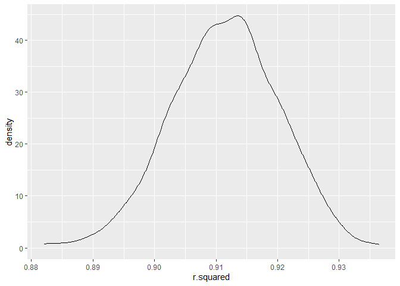
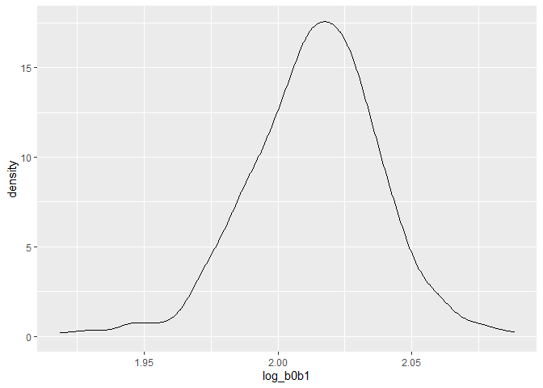
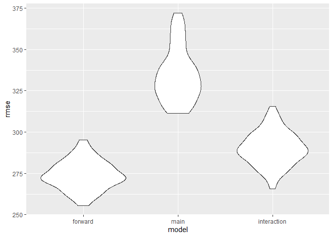

p8105_hw6_qz2493.Rmd
================
Qingyue Zhuo qz2493
2022-11-27

### Problem 1

To obtain a distribution for $\hat{r}^2$, we’ll follow basically the
same procedure we used for regression coefficients: draw bootstrap
samples; the a model to each; extract the value I’m concerned with; and
summarize. Here, we’ll use `modelr::bootstrap` to draw the samples and
`broom::glance` to produce `r.squared` values.

``` r
weather_df = 
  rnoaa::meteo_pull_monitors(
    c("USW00094728"),
    var = c("PRCP", "TMIN", "TMAX"), 
    date_min = "2017-01-01",
    date_max = "2017-12-31") %>%
  mutate(
    name = recode(id, USW00094728 = "CentralPark_NY"),
    tmin = tmin / 10,
    tmax = tmax / 10) %>%
  select(name, id, everything())
```

    ## Registered S3 method overwritten by 'hoardr':
    ##   method           from
    ##   print.cache_info httr

    ## using cached file: C:\Users\HW\AppData\Local/Cache/R/noaa_ghcnd/USW00094728.dly

    ## date created (size, mb): 2022-09-29 10:33:01 (8.418)

    ## file min/max dates: 1869-01-01 / 2022-09-30

``` r
weather_df %>% 
  modelr::bootstrap(n = 1000) %>% 
  mutate(
    models = map(strap, ~lm(tmax ~ tmin, data = .x) ),
    results = map(models, broom::glance)) %>% 
  select(-strap, -models) %>% 
  unnest(results) %>% 
  ggplot(aes(x = r.squared)) + geom_density()
```

<!-- -->

In this example, the $\hat{r}^2$ value is high, and the upper bound at 1
may be a cause for the generally skewed shape of the distribution. If we
wanted to construct a confidence interval for $R^2$, we could take the
2.5% and 97.5% quantiles of the estimates across bootstrap samples.
However, because the shape isn’t symmetric, using the mean +/- 1.96
times the standard error probably wouldn’t work well.

We can produce a distribution for $\log(\beta_0 * \beta1)$ using a
similar approach, with a bit more wrangling before we make our plot.

``` r
weather_df %>% 
  modelr::bootstrap(n = 1000) %>% 
  mutate(
    models = map(strap, ~lm(tmax ~ tmin, data = .x) ),
    results = map(models, broom::tidy)) %>% 
  select(-strap, -models) %>% 
  unnest(results) %>% 
  select(id = `.id`, term, estimate) %>% 
  pivot_wider(
    names_from = term, 
    values_from = estimate) %>% 
  rename(beta0 = `(Intercept)`, beta1 = tmin) %>% 
  mutate(log_b0b1 = log(beta0 * beta1)) %>% 
  ggplot(aes(x = log_b0b1)) + geom_density()
```

<!-- -->

As with $r^2$, this distribution is somewhat skewed and has some
outliers.

The point of this is not to say you should always use the bootstrap –
it’s possible to establish “large sample” distributions for strange
parameters / values / summaries in a lot of cases, and those are great
to have. But it is helpful to know that there’s a way to do inference
even in tough cases.

## Problem 2

### Load and Clean the Dataset

- Load the data

``` r
raw_data = read_csv("https://raw.githubusercontent.com/washingtonpost/data-homicides/master/homicide-data.csv")
```

    ## Rows: 52179 Columns: 12
    ## ── Column specification ────────────────────────────────────────────────────────
    ## Delimiter: ","
    ## chr (9): uid, victim_last, victim_first, victim_race, victim_age, victim_sex...
    ## dbl (3): reported_date, lat, lon
    ## 
    ## ℹ Use `spec()` to retrieve the full column specification for this data.
    ## ℹ Specify the column types or set `show_col_types = FALSE` to quiet this message.

- Clean the data

``` r
homicide_df =
  raw_data %>%
  janitor::clean_names() %>%
  
  # create new variables
  # convert "victim_age" to numeric variable
  mutate(
    city_state = str_c(city, state, sep = ","),
    resolved = as.numeric(disposition == "Closed by arrest"),
    victim_age = as.numeric(victim_age)) %>%
  
  relocate(city_state) %>%
  
  # filter out certain observations
  filter(
    !(city_state %in% c("Dallas,TX", "Phoenix,AZ", " Kansas City,MO", "Tulsa,AL")) &
    victim_race %in% c("Black", "White"))
```

    ## Warning in mask$eval_all_mutate(quo): NAs introduced by coercion

### Model Fitting

#### Baltimore Model Fitting

- Fit a logistic regression model for “Baltimore,MD” and extract
  estimated OR and the corresponding CIs

``` r
baltimore_df =
  homicide_df %>%
  filter(city_state == "Baltimore,MD" )

baltimore_fit = 
  glm(resolved ~ victim_age + victim_sex + victim_race, family = binomial, data = baltimore_df) %>%
  broom::tidy() %>% 
  mutate(
    OR = exp(estimate),
    conf.lower = exp(estimate - 1.96*std.error),
    conf.upper = exp(estimate + 1.96*std.error)) %>%
  filter(term == "victim_sexMale") %>%
  select(term, OR, conf.lower, conf.upper)

baltimore_fit
```

    ## # A tibble: 1 × 4
    ##   term              OR conf.lower conf.upper
    ##   <chr>          <dbl>      <dbl>      <dbl>
    ## 1 victim_sexMale 0.426      0.325      0.558

The estimate value of the adjusted odds ratio is 0.4255117, the
corresponding confidence interval is \[0.324559, 0.5578655\].

#### Iterate over each of the cities

- Build a function that takes city name as input and returns estimated
  OR and CI.

``` r
OR_function = function(city_df) {
  
  city_fit = 
    glm(resolved ~ victim_age + victim_sex + victim_race, family = binomial, data = city_df) %>%
  broom::tidy() %>% 
  mutate(
    OR = exp(estimate),
    conf.lower = exp(estimate - 1.96*std.error),
    conf.upper = exp(estimate + 1.96*std.error)) %>%
  filter(term == "victim_sexMale") %>%
  select(OR, conf.lower, conf.upper)
  
  return(city_fit)
}
```

- Apply the function to each of the cities

``` r
results_df = 
  homicide_df %>%
  nest(data = uid:resolved) %>%
  mutate(
    fit_results = map(data, OR_function)) %>%
  select(-data) %>%
  unnest(fit_results)

results_df %>%
  knitr::kable(digits = 3)
```

| city_state        |    OR | conf.lower | conf.upper |
|:------------------|------:|-----------:|-----------:|
| Albuquerque,NM    | 1.767 |      0.831 |      3.761 |
| Atlanta,GA        | 1.000 |      0.684 |      1.463 |
| Baltimore,MD      | 0.426 |      0.325 |      0.558 |
| Baton Rouge,LA    | 0.381 |      0.209 |      0.695 |
| Birmingham,AL     | 0.870 |      0.574 |      1.318 |
| Boston,MA         | 0.674 |      0.356 |      1.276 |
| Buffalo,NY        | 0.521 |      0.290 |      0.935 |
| Charlotte,NC      | 0.884 |      0.557 |      1.403 |
| Chicago,IL        | 0.410 |      0.336 |      0.501 |
| Cincinnati,OH     | 0.400 |      0.236 |      0.677 |
| Columbus,OH       | 0.532 |      0.378 |      0.750 |
| Denver,CO         | 0.479 |      0.236 |      0.971 |
| Detroit,MI        | 0.582 |      0.462 |      0.734 |
| Durham,NC         | 0.812 |      0.392 |      1.683 |
| Fort Worth,TX     | 0.669 |      0.397 |      1.127 |
| Fresno,CA         | 1.335 |      0.580 |      3.071 |
| Houston,TX        | 0.711 |      0.558 |      0.907 |
| Indianapolis,IN   | 0.919 |      0.679 |      1.242 |
| Jacksonville,FL   | 0.720 |      0.537 |      0.966 |
| Las Vegas,NV      | 0.837 |      0.608 |      1.154 |
| Long Beach,CA     | 0.410 |      0.156 |      1.082 |
| Los Angeles,CA    | 0.662 |      0.458 |      0.956 |
| Louisville,KY     | 0.491 |      0.305 |      0.790 |
| Memphis,TN        | 0.723 |      0.529 |      0.988 |
| Miami,FL          | 0.515 |      0.304 |      0.872 |
| Milwaukee,wI      | 0.727 |      0.499 |      1.060 |
| Minneapolis,MN    | 0.947 |      0.478 |      1.875 |
| Nashville,TN      | 1.034 |      0.685 |      1.562 |
| New Orleans,LA    | 0.585 |      0.422 |      0.811 |
| New York,NY       | 0.262 |      0.138 |      0.499 |
| Oakland,CA        | 0.563 |      0.365 |      0.868 |
| Oklahoma City,OK  | 0.974 |      0.624 |      1.520 |
| Omaha,NE          | 0.382 |      0.203 |      0.721 |
| Philadelphia,PA   | 0.496 |      0.378 |      0.652 |
| Pittsburgh,PA     | 0.431 |      0.265 |      0.700 |
| Richmond,VA       | 1.006 |      0.498 |      2.033 |
| San Antonio,TX    | 0.705 |      0.398 |      1.249 |
| Sacramento,CA     | 0.669 |      0.335 |      1.337 |
| Savannah,GA       | 0.867 |      0.422 |      1.780 |
| San Bernardino,CA | 0.500 |      0.171 |      1.462 |
| San Diego,CA      | 0.413 |      0.200 |      0.855 |
| San Francisco,CA  | 0.608 |      0.317 |      1.165 |
| St. Louis,MO      | 0.703 |      0.530 |      0.932 |
| Stockton,CA       | 1.352 |      0.621 |      2.942 |
| Tampa,FL          | 0.808 |      0.348 |      1.876 |
| Tulsa,OK          | 0.976 |      0.614 |      1.552 |
| Washington,DC     | 0.690 |      0.468 |      1.017 |

- Generate the plot of estimated ORs and CIs across each city

``` r
results_df %>%
  mutate(
    city_state = fct_reorder(city_state, OR)) %>%
  ggplot(aes(x = city_state, y = OR)) +
  geom_point() + 
  labs(
    title = "Estimated Odds Ratio and Confidence Interval for each Cities",
    x = "City State",
    y = "Odds Raio") +
  geom_errorbar(aes(ymin = conf.lower, ymax = conf.upper)) +
  theme(axis.text.x = element_text(angle = 90, vjust = 0.5, hjust = 1))
```

<!-- -->
Comment on the plot:

- New York,NY has the lowest odds ratio, suggesting male in New York has
  the least odds of solving homicides compared with female in the same
  city.
- Atlanta,GA has an odds ratio equal to 1, indicating it achieves gender
  equity in solving homicide problem.
- Only five cities (Albuquerque,NM; Fresno,CA; Stockton,CA;
  Nashville,TN; Richmond,VA) have estimated odds ratio greater than 1;
  whereas all others have odds ratio smaller than 1, indicating males
  have significantly lower chances of solving homicides problems.
- As estimated odds ratio grows, the corresponding CI is growing wider
  generally, especially for those with ORs\>1; suggesting greater
  variability&uncertainty in the OR.

### Problem 3

#### Data Cleaning

- Load the data

``` r
birthwt_raw = read_csv("birthweight.csv")
```

    ## Rows: 4342 Columns: 20
    ## ── Column specification ────────────────────────────────────────────────────────
    ## Delimiter: ","
    ## dbl (20): babysex, bhead, blength, bwt, delwt, fincome, frace, gaweeks, malf...
    ## 
    ## ℹ Use `spec()` to retrieve the full column specification for this data.
    ## ℹ Specify the column types or set `show_col_types = FALSE` to quiet this message.

- Clean the data

``` r
birthwt_df =
  birthwt_raw %>%
  janitor::clean_names() %>%
  
  # convert categorical variables to factors
  mutate(
    babysex = as.factor(babysex),
    frace = as.factor(frace),
    malform = as.factor(malform),
    mrace = as.factor(mrace)
  ) %>%
  
  # drop the missing data
  drop_na()

# check for mising data
sum(!complete.cases(birthwt_df))
```

    ## [1] 0

There is no missing data.

#### Model Fitting

Here I fit a model through forward selection: start with no predictors
in the model and add new predictors one by one until no significant
predictors can be selected.

``` r
min.model = lm(bwt ~ 1, data = birthwt_df)

mod_forward = step(min.model, direction = 'forward', scope = (~ babysex + bhead + blength + delwt + fincome + frace + gaweeks + malform + menarche + mheight + momage + mrace + parity + pnumlbw + pnumsga + ppbmi + ppwt + smoken + wtgain))
```

    ## Start:  AIC=54177.22
    ## bwt ~ 1
    ## 
    ##            Df Sum of Sq        RSS   AIC
    ## + bhead     1 635559826  503092368 50633
    ## + blength   1 629354727  509297466 50686
    ## + gaweeks   1 193451443  945200751 53371
    ## + mrace     3 102185313 1036466880 53775
    ## + frace     4  99855116 1038797077 53787
    ## + delwt     1  94371782 1044280412 53804
    ## + wtgain    1  69610184 1069042010 53905
    ## + mheight   1  42046665 1096605529 54016
    ## + ppwt      1  38087313 1100564881 54032
    ## + fincome   1  27205079 1111447115 54074
    ## + momage    1  20990388 1117661805 54098
    ## + ppbmi     1  10049517 1128602677 54141
    ## + babysex   1   8547634 1130104560 54147
    ## + smoken    1   6512595 1132139598 54154
    ## + menarche  1    679279 1137972914 54177
    ## <none>                  1138652193 54177
    ## + parity    1     79849 1138572345 54179
    ## + malform   1      2024 1138650169 54179
    ## 
    ## Step:  AIC=50632.56
    ## bwt ~ bhead
    ## 
    ##            Df Sum of Sq       RSS   AIC
    ## + blength   1 140260834 362831534 49215
    ## + mrace     3  26795387 476296980 50401
    ## + frace     4  24953694 478138674 50420
    ## + gaweeks   1  22265695 480826672 50438
    ## + delwt     1  19472338 483620030 50463
    ## + wtgain    1  14330260 488762108 50509
    ## + mheight   1  12676960 490415408 50524
    ## + ppwt      1   7580954 495511414 50569
    ## + fincome   1   5357287 497735081 50588
    ## + momage    1   3488320 499604047 50604
    ## + babysex   1   1825927 501266440 50619
    ## + smoken    1   1424897 501667471 50622
    ## + ppbmi     1    983475 502108893 50626
    ## + menarche  1    559731 502532637 50630
    ## <none>                  503092368 50633
    ## + parity    1     49583 503042785 50634
    ## + malform   1       934 503091433 50635
    ## 
    ## Step:  AIC=49215.44
    ## bwt ~ bhead + blength
    ## 
    ##            Df Sum of Sq       RSS   AIC
    ## + mrace     3  17083538 345747996 49012
    ## + frace     4  15990457 346841077 49028
    ## + delwt     1   8805086 354026448 49111
    ## + gaweeks   1   7667503 355164031 49125
    ## + wtgain    1   6887951 355943583 49134
    ## + mheight   1   5041499 357790035 49157
    ## + fincome   1   4952952 357878582 49158
    ## + ppwt      1   3229239 359602295 49179
    ## + momage    1   2833954 359997579 49183
    ## + babysex   1   1778849 361052685 49196
    ## + smoken    1    505774 362325760 49211
    ## + ppbmi     1    481792 362349742 49212
    ## + parity    1    276204 362555330 49214
    ## + menarche  1    207816 362623718 49215
    ## <none>                  362831534 49215
    ## + malform   1     18474 362813059 49217
    ## 
    ## Step:  AIC=49012.04
    ## bwt ~ bhead + blength + mrace
    ## 
    ##            Df Sum of Sq       RSS   AIC
    ## + delwt     1   9600801 336147195 48892
    ## + wtgain    1   7452904 338295092 48919
    ## + gaweeks   1   5451245 340296751 48945
    ## + smoken    1   3698418 342049578 48967
    ## + ppwt      1   3474684 342273312 48970
    ## + mheight   1   3341916 342406080 48972
    ## + babysex   1   1752177 343995819 48992
    ## + ppbmi     1   1023993 344724003 49001
    ## + fincome   1    464468 345283528 49008
    ## + parity    1    288533 345459463 49010
    ## + menarche  1    229273 345518723 49011
    ## <none>                  345747996 49012
    ## + momage    1    155890 345592106 49012
    ## + malform   1       226 345747770 49014
    ## + frace     4    147864 345600132 49018
    ## 
    ## Step:  AIC=48891.76
    ## bwt ~ bhead + blength + mrace + delwt
    ## 
    ##            Df Sum of Sq       RSS   AIC
    ## + gaweeks   1   5003062 331144133 48829
    ## + smoken    1   4705038 331442158 48833
    ## + ppbmi     1   3252449 332894746 48852
    ## + ppwt      1   2702535 333444660 48859
    ## + wtgain    1   2702535 333444660 48859
    ## + babysex   1   1568123 334579073 48873
    ## + mheight   1    491094 335656102 48887
    ## + fincome   1    366935 335780260 48889
    ## + parity    1    282825 335864370 48890
    ## <none>                  336147195 48892
    ## + menarche  1     57609 336089587 48893
    ## + momage    1     16752 336130444 48894
    ## + malform   1       645 336146550 48894
    ## + frace     4    108762 336038434 48898
    ## 
    ## Step:  AIC=48828.65
    ## bwt ~ bhead + blength + mrace + delwt + gaweeks
    ## 
    ##            Df Sum of Sq       RSS   AIC
    ## + smoken    1   5103084 326041049 48763
    ## + ppbmi     1   2982414 328161719 48791
    ## + ppwt      1   2239246 328904887 48801
    ## + wtgain    1   2239246 328904887 48801
    ## + babysex   1   1098219 330045914 48816
    ## + mheight   1    576307 330567826 48823
    ## + parity    1    491833 330652300 48824
    ## + fincome   1    296410 330847723 48827
    ## <none>                  331144133 48829
    ## + menarche  1     63917 331080216 48830
    ## + momage    1      1327 331142806 48831
    ## + malform   1        56 331144077 48831
    ## + frace     4     98684 331045449 48835
    ## 
    ## Step:  AIC=48763.22
    ## bwt ~ bhead + blength + mrace + delwt + gaweeks + smoken
    ## 
    ##            Df Sum of Sq       RSS   AIC
    ## + ppbmi     1   3256005 322785044 48722
    ## + ppwt      1   2379974 323661075 48733
    ## + wtgain    1   2379974 323661075 48733
    ## + babysex   1    887854 325153195 48753
    ## + mheight   1    655049 325386001 48756
    ## + parity    1    478200 325562850 48759
    ## + fincome   1    234787 325806262 48762
    ## <none>                  326041049 48763
    ## + menarche  1     40880 326000169 48765
    ## + malform   1      2470 326038580 48765
    ## + momage    1       169 326040881 48765
    ## + frace     4    144579 325896470 48769
    ## 
    ## Step:  AIC=48721.64
    ## bwt ~ bhead + blength + mrace + delwt + gaweeks + smoken + ppbmi
    ## 
    ##            Df Sum of Sq       RSS   AIC
    ## + babysex   1    840246 321944798 48712
    ## + parity    1    452566 322332478 48718
    ## + ppwt      1    208200 322576844 48721
    ## + wtgain    1    208200 322576844 48721
    ## + fincome   1    192192 322592852 48721
    ## + mheight   1    149539 322635505 48722
    ## <none>                  322785044 48722
    ## + menarche  1    127354 322657690 48722
    ## + momage    1     27180 322757863 48723
    ## + malform   1       990 322784054 48724
    ## + frace     4    128299 322656745 48728
    ## 
    ## Step:  AIC=48712.32
    ## bwt ~ bhead + blength + mrace + delwt + gaweeks + smoken + ppbmi + 
    ##     babysex
    ## 
    ##            Df Sum of Sq       RSS   AIC
    ## + parity    1    420128 321524670 48709
    ## + ppwt      1    236436 321708362 48711
    ## + wtgain    1    236436 321708362 48711
    ## + fincome   1    200080 321744718 48712
    ## + mheight   1    172280 321772518 48712
    ## <none>                  321944798 48712
    ## + menarche  1    124349 321820449 48713
    ## + momage    1     35713 321909085 48714
    ## + malform   1      2149 321942649 48714
    ## + frace     4    129104 321815695 48719
    ## 
    ## Step:  AIC=48708.65
    ## bwt ~ bhead + blength + mrace + delwt + gaweeks + smoken + ppbmi + 
    ##     babysex + parity
    ## 
    ##            Df Sum of Sq       RSS   AIC
    ## + ppwt      1    222350 321302320 48708
    ## + wtgain    1    222350 321302320 48708
    ## + fincome   1    213427 321311243 48708
    ## + mheight   1    158777 321365893 48709
    ## <none>                  321524670 48709
    ## + menarche  1    133321 321391348 48709
    ## + momage    1     21537 321503133 48710
    ## + malform   1      2258 321522412 48711
    ## + frace     4    128420 321396250 48715
    ## 
    ## Step:  AIC=48707.65
    ## bwt ~ bhead + blength + mrace + delwt + gaweeks + smoken + ppbmi + 
    ##     babysex + parity + ppwt
    ## 
    ##            Df Sum of Sq       RSS   AIC
    ## + fincome   1    253537 321048783 48706
    ## <none>                  321302320 48708
    ## + menarche  1    103765 321198555 48708
    ## + mheight   1     81405 321220915 48709
    ## + momage    1     46364 321255955 48709
    ## + malform   1      1087 321301233 48710
    ## + frace     4    132681 321169639 48714
    ## 
    ## Step:  AIC=48706.22
    ## bwt ~ bhead + blength + mrace + delwt + gaweeks + smoken + ppbmi + 
    ##     babysex + parity + ppwt + fincome
    ## 
    ##            Df Sum of Sq       RSS   AIC
    ## <none>                  321048783 48706
    ## + menarche  1     99033 320949751 48707
    ## + mheight   1     71194 320977589 48707
    ## + momage    1     12410 321036373 48708
    ## + malform   1      1734 321047050 48708
    ## + frace     4    130628 320918155 48712

The resulting model contains the following predictors:

- baby’s head circumference

- baby’s length at birth

- mother’s race

- mother’s weight at delivery

- gestational age in weeks

- average number of cigarettes smoked per day during pregnancy

- mother’s BMI

- baby’s sex

- number of prior live birth

- mother’s pre-preganacy weight

- monthly family income

- Final model

``` r
mod1 = lm(bwt ~ bhead + blength + mrace + delwt + gaweeks + smoken + ppbmi + 
    babysex + parity + ppwt + fincome, data = birthwt_df)
```

- Plot of model residuals against fitted values

``` r
birthwt_df %>%
  add_residuals(mod1) %>%
  add_predictions(mod1) %>%
  ggplot(aes(x = pred, y = resid)) + 
  geom_point() +
  labs(title = "Residuals vs. Fitted Values")
```

<!-- -->

- Fit two other models for comparison

``` r
mod2 = lm(bwt ~ blength + gaweeks, data = birthwt_df)
mod3 = lm(bwt ~ bhead + blength + babysex + bhead*blength + bhead*babysex + blength*babysex + bhead*blength*babysex, data = birthwt_df)
```

### Model Comparison

``` r
cv_df = 
  crossv_mc(birthwt_df, 100) %>%
  mutate(
    train = map(train, as_tibble),
    test = map(test, as_tibble))
```

- Fit models to training dataset and obtain corresponding RMSEs for the
  testing data

``` r
cv_df = 
  cv_df %>%
  mutate(
    forward_mod = map(train, 
                      ~lm(bwt ~ bhead + blength + mrace + delwt + gaweeks + smoken + 
                           ppbmi + babysex + parity + ppwt + fincome, data = .x)),
    
    main_mod = map(train, ~lm(bwt ~ blength + gaweeks, data = .x)),
    
    interaction_mod = map(train, ~lm(bwt ~ bhead + blength + babysex + 
                                          bhead*blength + bhead*babysex + blength*babysex + 
                                          bhead*blength*babysex, data = .x))) %>%
  mutate(
    rmse_forward = map2_dbl(forward_mod, test, ~rmse(model = .x, data = .y)),
    rmse_main = map2_dbl(main_mod, test, ~rmse(model = .x, data = .y)),
    rmse_interaction = map2_dbl(interaction_mod, test, ~rmse(model = .x, data = .y)))
```

- Plot the prediction error distribution for each candidate model

``` r
cv_df %>%
  select(starts_with("rmse")) %>%
  pivot_longer(
    everything(),
    names_to = "model",
    values_to = "rmse",
    names_prefix = "rmse_") %>%
  mutate(model = fct_inorder(model)) %>%
  ggplot(aes(x = model, y = rmse)) + geom_violin()
```

<!-- -->

We can conclude from the plot: the forward_selection_model has the
lowest RMSE, suggesting it has the highest prediction accuracy thus the
best performance. The interaction model has a slightly greater RMSE, but
it is more complex compared to simple linear regression model. While the
second model (main_effect model) has a very large RMSE.
